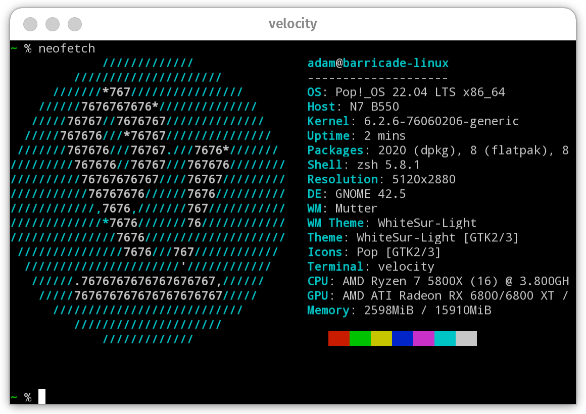

<b><i>My terminal, velocity</b></i>

---

## What is it?

A UNIX terminal emulator written from the ground up as a
learning exercise. It depends on practically nothing. The
parsing, escape sequence implementation, etc. is all custom.

<table>
<tr>
  <th>neofetch</th><th>git</th>
</tr>
<tr>
<td>
  
</td>
<td>
  
</td>
</tr>
<tr>
  <th>nano</th>
  <th>Escape codes printed by a program from my hand-written C compiler</th>
</tr>
<tr>
<td>
  
</td>
<td>
  
</td>
</tr>
<tr>
  <th>It's also somewhat cross-platform. Here it is on Linux!</th>
</tr>
<td>
  
</td>
</table>

## Is it the best/fastest/most cromulent at $X?

No. Ironically the name doesn't even refer to a speed-related
goal. It's just a gag because it goes with the word Terminal
and my first thought, "illness", didn't have such a nice ring
to it.

---

<h6 align=center>By Adam Soutar
